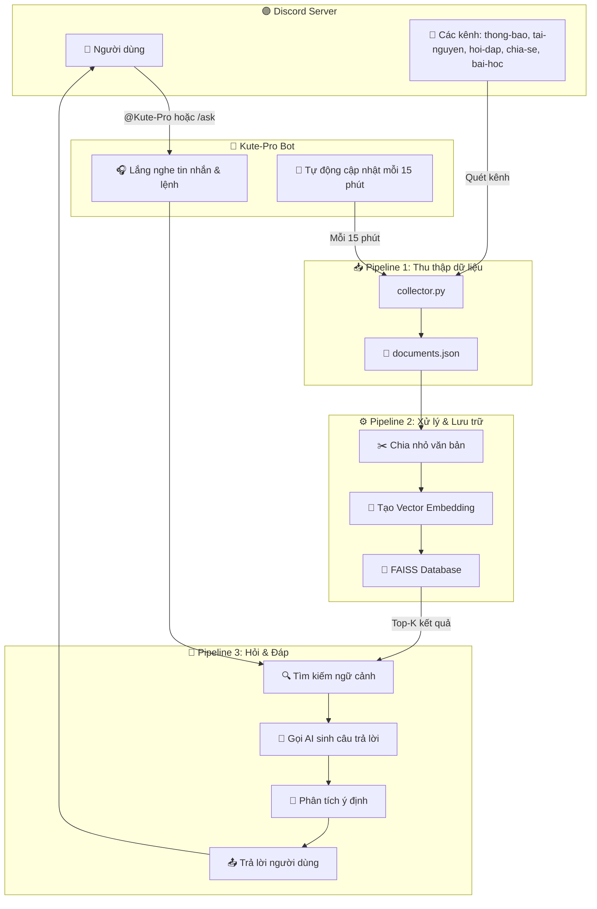
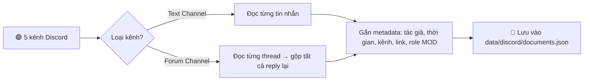
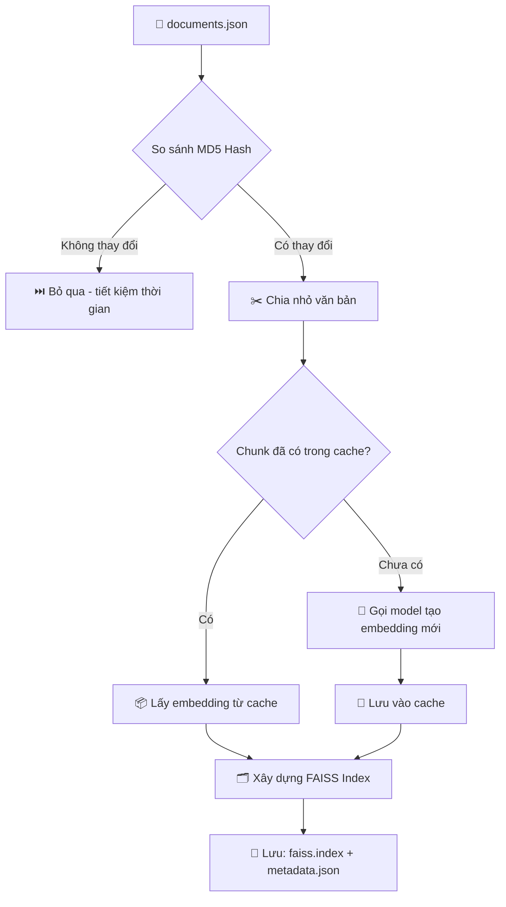
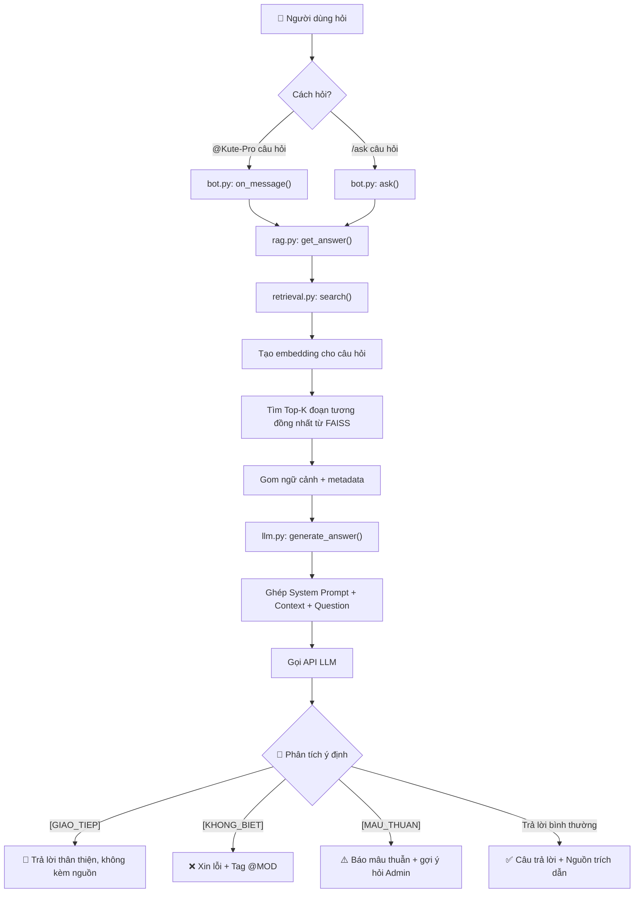
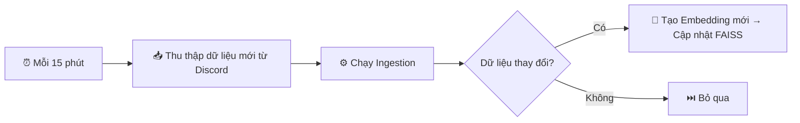

# 🔄 Pipeline Hệ Thống Kute-Pro Bot

> Tài liệu mô tả toàn bộ luồng hoạt động của bot từ A → Z, giúp team nắm rõ hệ thống hoạt động như thế nào.

---

## 📌 Tổng quan

Kute-Pro là một **Discord Bot trợ lý ảo** sử dụng công nghệ RAG (Retrieval-Augmented Generation) để:
1. Tự động **thu thập** tin nhắn từ các kênh Discord
2. **Lưu trữ** dưới dạng vector trong cơ sở dữ liệu FAISS
3. **Tìm kiếm** thông tin liên quan khi người dùng đặt câu hỏi
4. **Sinh câu trả lời** thông minh bằng LLM (AI)

---

## 🗺️ Sơ đồ tổng quan



---

## 📥 Pipeline 1: Thu thập dữ liệu (Data Collection)

**File:** `src/collector.py`

**Mục đích:** Bot tự động đọc lịch sử tin nhắn từ 5 kênh Discord được cấu hình sẵn và lưu thành file JSON.



### Các kênh được thu thập:
| Kênh | Loại |
|------|------|
| `thong-bao` | Text Channel |
| `tai-nguyen` | Text Channel |
| `hoi-dap` | Forum Channel |
| `chia-se` | Forum Channel |
| `bai-hoc` | Forum Channel |

### Thông tin lưu cho mỗi tin nhắn:
- **text**: Nội dung tin nhắn
- **channel**: Tên kênh
- **thread**: Tên thread (nếu là Forum)
- **url**: Link nhảy tới tin nhắn gốc trên Discord
- **author**: Tên người viết
- **is_mod**: Người viết có phải MOD/TA không (true/false)
- **created_at**: Thời gian đăng (đã chuyển sang giờ Việt Nam GMT+7)

### Đặc biệt với Forum Channel:
- Tất cả các reply trong cùng 1 thread được **gộp lại thành 1 document duy nhất**
- Mỗi reply được gắn tên tác giả + thời gian (ví dụ: `Admin - Hoàn (20:20 ngày 30/07/2026): nội dung...`)
- Nếu tác giả có role MOD → tên được gắn thêm tag `[MOD]`

---

## ⚙️ Pipeline 2: Xử lý & Lưu trữ (Ingestion)

**File:** `src/ingest.py`, `src/utils.py`, `src/llm.py`, `src/vector_db.py`

**Mục đích:** Đọc file JSON từ bước 1, chia nhỏ văn bản, chuyển thành vector số và lưu vào cơ sở dữ liệu FAISS.



### Bước 2.1 — Kiểm tra thay đổi (MD5 Hash)
- Trước khi xử lý, hệ thống so sánh mã MD5 của file `documents.json` hiện tại với lần chạy trước
- **Nếu không thay đổi** → bỏ qua toàn bộ để tiết kiệm thời gian và API
- **Nếu có thay đổi** → tiếp tục xử lý

### Bước 2.2 — Chia nhỏ văn bản (Text Chunking)
**File:** `src/utils.py` → hàm `chunk_text()`
- Mỗi document được chia thành các đoạn nhỏ ~1000 ký tự
- Có **200 ký tự chồng lặp** (overlap) giữa các đoạn để không bị mất ngữ cảnh
- Ưu tiên cắt tại vị trí đẹp: dấu xuống dòng `\n\n`, dấu chấm câu `. `, khoảng trắng

### Bước 2.3 — Tạo Vector Embedding
**File:** `src/llm.py` → hàm `generate_embedding()`
- Sử dụng model **`openai/text-embedding-3-small`** qua OpenRouter Embeddings API
- Mỗi đoạn văn bản được chuyển thành 1 vector số (danh sách các số thập phân)
- Hệ thống có **cache thông minh**: nếu đoạn text đã từng được embedding trước đó → lấy từ cache, không cần gọi model lại

### Bước 2.4 — Lưu vào FAISS
**File:** `src/vector_db.py`
- Sử dụng thuật toán **IndexFlatL2** (khoảng cách Euclidean) để so sánh độ tương đồng
- Lưu 2 file:
  - `data/discord/faiss.index` — Cơ sở dữ liệu vector
  - `data/discord/metadata.json` — Thông tin chi tiết (tác giả, kênh, link,...)

---

## 💬 Pipeline 3: Hỏi & Đáp (Question Answering)

**File:** `src/bot.py`, `src/rag.py`, `src/retrieval.py`, `src/llm.py`, `src/prompts.py`

**Mục đích:** Khi người dùng đặt câu hỏi → tìm thông tin liên quan → gọi AI sinh câu trả lời.



### Bước 3.1 — Nhận câu hỏi
Người dùng có 2 cách gọi bot:
- **Tag trực tiếp:** `@Kute-Pro tối nay có sự kiện gì?`
- **Slash command:** `/ask tối nay có sự kiện gì?`

### Bước 3.2 — Tìm kiếm ngữ cảnh (Retrieval)
**File:** `src/retrieval.py`
1. Câu hỏi được chuyển thành vector embedding (cùng model với bước ingestion)
2. Tìm **Top-K** (mặc định K=5) đoạn văn bản có độ tương đồng cao nhất từ FAISS
3. Trả về danh sách các document kèm metadata

### Bước 3.3 — Sinh câu trả lời (Generation)
**File:** `src/llm.py` → hàm `generate_answer()`
1. Gom các đoạn ngữ cảnh tìm được, gắn thêm metadata (tác giả, thời gian, kênh)
2. Nếu tác giả là MOD → đánh dấu `[MOD]` để LLM ưu tiên
3. Ghép lại thành prompt hoàn chỉnh: **System Prompt** + **Context** + **Câu hỏi**
4. Gọi API LLM (qua OpenAI/OpenRouter) với `temperature=0.0` để câu trả lời ổn định, không bịa

### Bước 3.4 — Phân tích ý định & Xử lý kết quả
**File:** `src/rag.py` → hàm `get_answer()`

LLM trả về kết quả kèm tag ý định, bot xử lý như sau:

| Tag từ LLM | Ý nghĩa | Cách bot xử lý |
|-------------|----------|-----------------|
| `[GIAO_TIEP]` | Câu chào hỏi, giao tiếp, hỏi về bot | Xóa tag → trả lời thân thiện, **không kèm nguồn** |
| `[KHONG_BIET]` | Không tìm thấy thông tin liên quan | Trả lời xin lỗi + **tự động tag @MOD** để gọi TA hỗ trợ |
| `[MAU_THUAN]` | Các nguồn mâu thuẫn nhau | Liệt kê các nguồn + **gợi ý hỏi Admin xác nhận** |
| *(không có tag)* | Trả lời bình thường | Trả lời đầy đủ + **kèm link nguồn trích dẫn** |

---

## 🔄 Pipeline Tự Động Cập Nhật (Auto-Update)

**File:** `src/bot.py` → hàm `auto_update_knowledge()`



- Bot tự động lặp lại Pipeline 1 + Pipeline 2 **mỗi 15 phút**
- Chạy ngầm trong luồng riêng (`asyncio.to_thread`) → **không làm gián đoạn** việc trả lời câu hỏi
- Nhờ cơ chế MD5 Hash + Embedding Cache → nếu dữ liệu không đổi thì **gần như không tốn tài nguyên**

---

## 🧠 System Prompt & Cách Bot "Suy Nghĩ"

**File:** `src/prompts.py`

Bot được hướng dẫn qua System Prompt với các quy tắc:

1. **Giao tiếp xã giao** → nhận diện câu chào hỏi → đáp lại thân thiện
2. **Câu hỏi kiến thức** → tìm trong ngữ cảnh → trả lời chi tiết kèm trích dẫn
3. **Phát hiện mâu thuẫn** → liệt kê các nguồn trái ngược → gợi ý hỏi Admin
4. **Hỏi về bản thân bot** → tự giới thiệu khả năng và cách sử dụng
5. **Ngoài phạm vi** → trung thực nói không biết → gọi MOD hỗ trợ

### Quy tắc đặc biệt:
- **Ưu tiên nguồn MOD**: Nếu có câu trả lời từ người có role MOD → **tin tuyệt đối**, không báo mâu thuẫn
- **Không bịa**: `temperature=0.0` + quy tắc `[KHONG_BIET]` → bot không tự sáng tạo thông tin
- **Phong cách**: Thân thiện, dùng emoji, xưng "mình" và "bạn", luôn có câu chốt ở cuối

---

## 🗂️ Cấu trúc file quan trọng

```
📦 K4-hackathon-ChamDeadline-E402/
├── 📄 run.py                          ← Điểm khởi chạy bot
├── 📁 src/
│   ├── bot.py                         ← Quản lý kết nối Discord, lắng nghe lệnh
│   ├── collector.py                   ← Thu thập tin nhắn từ Discord
│   ├── ingest.py                      ← Chia nhỏ + Embedding + Lưu FAISS
│   ├── retrieval.py                   ← Tìm kiếm ngữ cảnh từ FAISS
│   ├── rag.py                         ← Ghép nối tìm kiếm + sinh câu trả lời
│   ├── llm.py                         ← Giao tiếp với model AI (Embedding + Generation)
│   ├── prompts.py                     ← System Prompt + Template câu hỏi
│   ├── vector_db.py                   ← Quản lý cơ sở dữ liệu FAISS
│   ├── config.py                      ← Tải biến môi trường từ .env
│   └── utils.py                       ← Hàm tiện ích (đọc JSON, chia nhỏ text)
├── 📁 data/discord/
│   ├── documents.json                 ← Dữ liệu thô từ Discord
│   ├── documents.json.md5             ← Mã hash kiểm tra thay đổi
│   ├── faiss.index                    ← Cơ sở dữ liệu vector
│   ├── metadata.json                  ← Metadata của từng chunk
│   └── embeddings_cache.json          ← Cache embedding đã tạo
└── 📄 .env                            ← Cấu hình bí mật (token, API key)
```

---

## ⚡ Công nghệ sử dụng

| Thành phần | Công nghệ | Vai trò |
|------------|-----------|---------|
| Bot Framework | discord.py | Kết nối và tương tác với Discord |
| Embedding Model | openai/text-embedding-3-small | Chuyển văn bản thành vector qua OpenRouter API |
| Vector Database | FAISS (Facebook) | Lưu trữ và tìm kiếm vector nhanh |
| LLM | OpenAI / OpenRouter API | Sinh câu trả lời thông minh |
| Config | python-dotenv | Quản lý biến môi trường |
